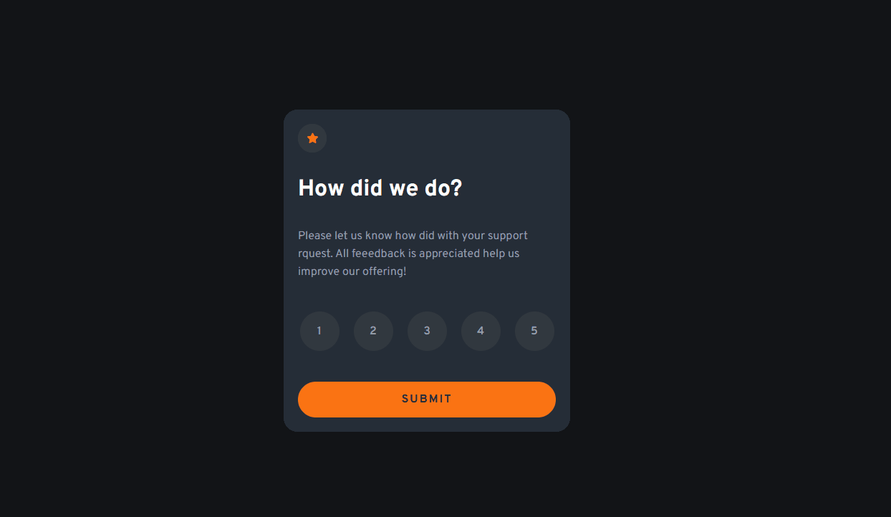
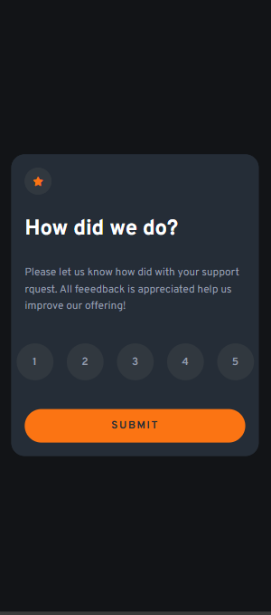

# 🎯 Interactive Rating Component
Este projeto foi feito através de um desafio do FrontEnd Mentor e é um componente interativo de avaliação que permite ao usuário selecionar uma nota (de 1 a 5) e, em seguida, visualizar um cartão de agradecimento exibindo a nota escolhida.

**Link para o página do desafio no FrontEnd Mentor:** https://www.frontendmentor.io/challenges/interactive-rating-component-koxpeBUmI

## ✅ Funcionalidades

- Design bonito e moderno
- Design reponsivo para despositivos mobile
- Efeito visual interativo nos botões
- O usuário pode selecionar uma nota (de 1 a 5) em um cartão interativo
- Ao clicar em "Submit", o cartão de avaliação desaparece, e um cartão de agradecimento surge exibindo a nota selecionada

## 🤖 Tecnologias utilizadas
HTML5 | CSS | JavaScript

## 💡 Desafios
Meus maiores desafios foram:

Colocar a lógica em prática no JavaScript
Manipulação funcional e limpa do DOM no JavaScript
Fazer o manejo correto das remoções e adições de classes utilizando as propriedades do JavaScript
Reproduzir o design de um projeto do FrontEnd Mentor utilizando HTML e CSS
Destribuir bem as funções de cada tecnologia

## 🚀 Aprendizados

Durante o desenvolvimento deste projeto, aprimorei habilidades essenciais em **HTML**, **CSS** e **JavaScript**, com foco nos seguintes pontos:

- **Manipulação do DOM:** Criando interatividade dinâmica com os botões de avaliação.  
- **Uso de Event Listeners:** Captura de eventos de clique e aplicação de lógica condicional.  
- **Classes Dinâmicas:** Marcação visual do botão selecionado e atualização do conteúdo exibido.  
- **Transições Suaves (CSS):** Aplicação de transições elegantes para uma experiência mais fluida.  
- **Código Semântico e Organizado:** Estruturação limpa e legível para melhor manutenção e entendimento.  

Este projeto foi um ótimo exercício prático para reforçar conceitos de **lógica de programação** e **manipulação de elementos na tela**, além de melhorar minha compreensão do **frontend**. 🚀

## Demonstração

## Design responsivo para mobile

   
Obrigado pela atenção :v